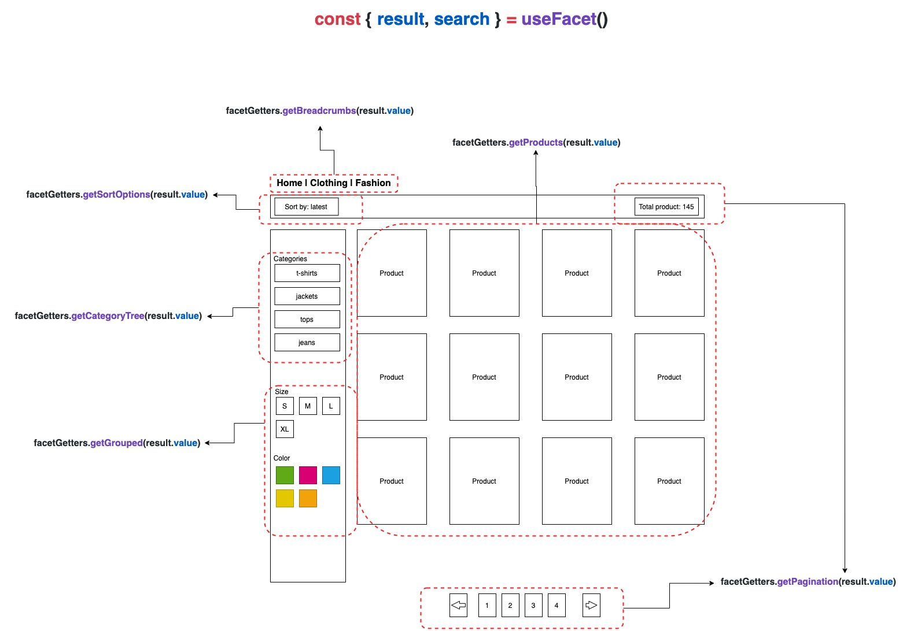

# Product catalog

There are two composables used to interact with the product catalog - `useProduct` and `useFacet`.

`useProduct` allows loading products and their variants when some parameters like IDs, SKUs, or slugs are already known. 

`useFacet` allows more complex queries where categories, search terms, filters, and other options can narrow down and sort the results.

## Fetching a single product and its variants

`useProduct` composable is used primarily on the Product Details Page to display information about a single product and its variants.

Use the `search` method to fetch the product and its variants. The response is available in the `products` object.

```vue
<script>
import { onSSR } from '@vue-storefront/core';
import { useProduct } from '{INTEGRATION}';

export default {
  setup () {
    const { products, search } = useProduct();

    onSSR(async () => {
      /**
       * "searchParams" may vary depending on the integration used.
       * Please refer to its documentation for more details.
       */
      await search(searchParams);
    })
    
    return {
      products
    };
  }
}
</script>

```

## Accessing product data

Once products are loaded using `useProduct`, access them using `productGetters`. Depending on the product, configuration, and integration used, the response might contain one or more products or variants. Use the `getFiltered` getter to access them.

For a full list of available getters, please refer to the [ProductGetters ](../core/api-reference/core.productgetters.html) interface.

### Accessing products list

Use the `getFiltered` getter without the second parameter to get the list of all products.

```vue{4,18-24}
<script>
import { onSSR } from '@vue-storefront/core';
import { computed } from '@vue/composition-api';
import { useProduct, productGetters } from '{INTEGRATION}';

export default {
  setup () {
    const { products, search } = useProduct();

    onSSR(async () => {
      /**
       * "searchParams" may vary depending on the integration used.
       * Please refer to its documentation for more details.
       */
      await search(searchParams);
    })

    const productList = computed(() => {
      return productGetters.getFiltered(products.value);
    });

    return {
      productList
    };
  }
}
</script>
```

### Accessing master variant

In most of the eCommerce backends, there is a so-called _master variant_. You can think of it as a default configuration for the product displayed to the user if they haven't selected any other configuration.

Let's use the `getFiltered` getter again, but this time pass `{ master: true }` as a second parameter to only get the master variant.

```vue{4,18-24}
<script>
import { onSSR } from '@vue-storefront/core';
import { computed } from '@vue/composition-api';
import { useProduct, productGetters } from '{INTEGRATION}';

export default {
  setup () {
    const { products, search } = useProduct();

    onSSR(async () => {
      /**
       * "searchParams" may vary depending on the integration used.
       * Please refer to its documentation for more details.
       */
      await search(searchParams);
    })

    const masterVariant = computed(() => {
      return productGetters.getFiltered(products.value, { master: true })[0];
    });

    return {
      masterVariant
    };
  }
}
</script>
```

:::warning `getFiltered` always returns an array
Even when `{ master: true }` is passed, the `getFiltered` getter still returns an array of products. In the example above, we used `[0]` to access the first element, but it might differ depending on the integration.
:::

### Accessing products with specific attributes

To only get the products with specific attributes, pass the `{ attributes }` object as a second parameter.

```vue{4,18-29}
<script>
import { onSSR } from '@vue-storefront/core';
import { computed } from '@vue/composition-api';
import { useProduct, productGetters } from '{INTEGRATION}';

export default {
  setup () {
    const { products, search } = useProduct();

    onSSR(async () => {
      /**
       * "searchParams" may vary depending on the integration used.
       * Please refer to its documentation for more details.
       */
      await search(searchParams);
    })

    const attributes = {
      size: '38',
      color: 'gray'
    };

    const selectedVariant = computed(() => {
      return productGetters.getFiltered(products.value, { attributes })[0];
    });

    return {
      selectedVariant
    };
  }
}
</script>
```

## Fetching a list of products and available filters

Faceted search allows users to narrow down search results by applying multiple filters (called dimensions) to the catalog data. In the clothing shop, facet (dimension) would be a brand, size, color, etc.

`useFacet` composable is used primarily on the Category Page to display products matching specified filters.

Use the `search` method to fetch the products. The response is available in the `result` object.

```vue
<script>
import { onSSR } from '@vue-storefront/core';
import { useFacet } from '{INTEGRATION}';

export default {
  setup () {
    const { result, search } = useFacet();

    onSSR(async () => {
      // This example shows only some of the available parameters.
      await search({
        categorySlug: '',
        rootCatSlug: '',
        term: '',
        page: 1,
        itemsPerPage: 10,
        sort: ''
      });
    })
    
    return {
      result
    };
  }
}
</script>
```

For a full list of parameters, please refer to the [AgnosticFacetSearchParams](../core/api-reference/core.agnosticfacetsearchparams.html) interface.

## Accessing catalog data

Once data is loaded using `useFacet`, access it using `facetGetters`. Get the data such as products, sorting and filtering options, pagination, and much more.

```vue{4,22-36}
<script>
import { onSSR } from '@vue-storefront/core';
import { computed } from '@vue/composition-api';
import { useFacet, facetGetters } from '{INTEGRATION}';

export default {
  setup () {
    const { result, search } = useFacet();

    onSSR(async () => {
      // This example shows only some of the available parameters.
      await search({
        categorySlug: '',
        rootCatSlug: '',
        term: '',
        page: 1,
        itemsPerPage: 10,
        sort: ''
      });
    })

    const breadcrumbs = computed(() => facetGetters.getBreadcrumbs(result.value));
    const sortBy = computed(() => facetGetters.getSortOptions(result.value));
    const categoryTree = computed(() => facetGetters.getCategoryTree(result.value));
    const facets = computed(() => facetGetters.getGrouped(result.value));
    const products = computed(() => facetGetters.getProducts(result.value));
    const pagination = computed(() => facetGetters.getPagination(result.value));
    
    return {
      breadcrumbs,
      sortBy,
      categoryTree,
      facets,
      products,
      pagination
    };
  }
}
</script>
```

For a full list of available getters, please refer to the [FacetsGetters](../core/api-reference/core.facetsgetters.html) interface.

The image below shows where each of these getters fits into a Category page.


